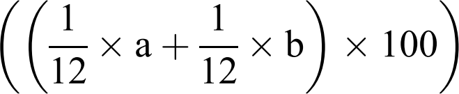

# Brainweaver manual

Brainweaver is a tool used by teachers that teach students to become
a teacher. 

It is beneficial for students to force these to think about
their own working theory. One of the ways to do so, is to
let the student create a concept map.

In Brainweaver,

 * a teacher ('Assessor') creates a file with a focal question
 * the student creates a concept map around that focal question
 * the teacher grades the concept map made by the students

## Controls

### Mouse

 * Double-click: create a new concept

### Keyboard

 * `CTRL + N`: create a new concept
 * `CTRL + E`: create a relation between two selected concepts
 * Space: select a random concept or relation
 * `SHIFT + arrows`: add concepts to selection
 * `CTRL + arrows`: move selected concepts
 * `CTRL + Z`: undo
 * `CTRL + SHIFT + Z`: redo
 * `ESC`: cancel creating a new relation, or close the dialog

## Recovering files

Every couple of seconds, the concept map is saved. 
Would Brainweaver be interrupted roughly (for example,
the computer its power cord is pulled), that concept map
can still be recovered. 

Just load the file `autosave1.cmp`.

## What is the file `autosave1.cmp`?

An auto-saved file.

Brainweaver saves a concept map every 1-10 seconds
as `autosave1.cmp` and `autosave2.cmp`

## What is the file `autosave2.cmp`?

An auto-saved file, that may be corrupt.

When Brainweaver saves a concept map every couple of seconds,
it first creates `autosave2.cmp`. If this fails, and `autosave2.cmp`
becomes corrupted, `autosave1.cmp` is still valid.

If `autosave2.cmp` can be created, it is assumed that `autosave1.cmp`
can be created with the same lack of errors.

## Calculations

### Richness

Richness is calculated as the equation below (from [1], page 617):

where

 * `a`: the number of domains of knowledge, excluding 'misc'
 * `b`: the number of domains (excluding 'misc') with a relative frequency between 12% and 25%

In Brainweaver, there are seven domains, of which 'misc' is excluded from the calculation:

 * `profession`: 'Beroepsdomein'
 * `organisations`: 'Organisaties'
 * `social_surroundings`: 'Sociale omgeving'
 * `target_audience`: 'Doelgroep'
 * `ti_knowledge`: 'Technical Instrumental knowledge', NL: 'Technische instrumentele kennis'
 * `prof_growth`: Professionele groei
 * `misc`: 'Overig'

To demonstrate this calculation, we will use a concept map with
only one added node with some examples:

---|---|---
`Competency         `|`#`|`  #`
---|---|---
`profession         `|`0`|`  1`
`organisations      `|`0`|`  1`
`social_surroundings`|`0`|`  1`
`target_audience    `|`0`|`  1`
`ti_knowledge       `|`0`|`  1`
`prof_growth        `|`0`|`  1`
---|---|---
`Score              `|` `|`   `
---|---|---
`a                  `|`0`|`  6`
`b                  `|`0`|`  6`
`r                  `|`0`|`100`
---|---|---

